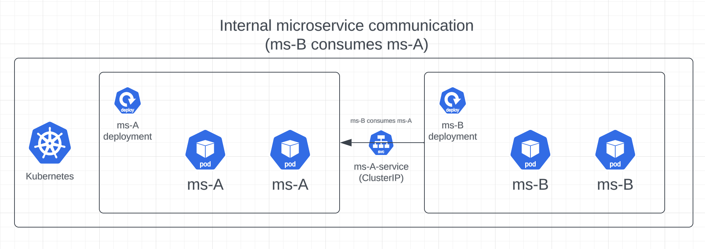

# multi-assignment (microservices)

## **Introduction**

Hello all, thank you for the opportunity for me to develop, architect and explain my decisions for this study case. 

All deliverables (and examples, starting with "example-"") will be inside the src/ folder.

src/application - contains all code and classes.
src/infrastructure - contains all scripts and K8S manifests.

You can find the repository [here](https://github.com/joao00paixao/multi-assignment).

## **Business Context**
Property Technology Solutions B.V. is pioneering digital transformations within the real estate industry. Our flagship mobile application, serving over 500k users, is emblematic of our dedication and prowess. This app, harnessing event campaigns, notifications, and personalized offers, thrives on .NET Core 6.

Our API, at present, supports 10+ distinct shopping center mobile applications. Despite each having its unique data set, they uniformly benefit from our robust API architecture.

## 1. **Microservices Architecture & Integration:**

>Detail your approach to structuring microservices and their inter-communication.

My best approach would be for these microservice applications to be orchestrated in a container orchestration technology like Kubernetes. 

Some of the benefits of having them living in containers and kubernetes itself are the following:

- Containerization (applications can be deployed all in the same environment)
- Security (network and "operating system" are isolated in the pods level, and on the K8S cluster level we can have certain port-forwarding / load balancing rules through K8S Services)
- Scaling (we can define the number of pods running parallel based on metrics)
-  Health-checks (health checks are regularly done to verify status of the pod, if the pod dies one is recreated with the same configuration)

For their inter-communication it is very simple. Kubernetes provides us with a resource called Service. A key aim of Services in Kubernetes is to abstract the exposure of groups of pods over the network. 

**Example**: We have three pods running an image uploading service. The frontend doesn't need to connect to a specific one, it just needs to find one of the three, and it will most likely be the most available one in terms of worker node resource usage. With this service we can abstract this to one single endpoint on the frontend side. 

We can apply the example to this context, but the frontend here would be microservice B and the image uploading service microservice A. They would be able to intercommunicate with eachother and be scalable.

For example ms-a.mycompany.com (with an ingress rule for this specific endpoint type, or the service's clusterIP which is constant and doesn't change) could live as the connection address in the application configuration of the ms-b application and ms-b would be able to communicate with ms-a, all internally.

---

>Explain strategies for seamless integration of microservices and handling potential issues.

For multiple replicas of one microservice the answer is in the previous answer and can be resolved using a K8S Service. The generated address will forward the request to one the available microservice pods (load balancing).

For different microservices and intercommunication there are several factors we must handle or take account of:

- Network Isolation

- Availability
  - Load balancing
  - Automatic Scaling
- Resilience
  - Self-healing
- Observability
  - Logging
  - Metrics
  - Tracing
  - Alerting

If the microservices need to communicate with eachother only they should be internal. If they need to communicate with external clients then we can either whitelist an IP address/range OR create a public endpoint.

If there is a lot of demand on one pod we should increase the amount of replicas in order to split the demand and not overwork one pod. This can also be said of the cluster's node itself, we can have pods in different worker nodes so we can split the work also between different servers. We can also load balance users between all active pods.

If a microservice crashes it must revive itself and be active, we need to atleast have one pod running.

For any other potential issues like application exceptions, pod logs and cluster errors we should have good structured logging according to the type of log. We should treat errors and exceptions with higher priority and we need observability or alerting of this. 

Metrics are also very important in order to measure resource consumption, vitals or executed actions during the application's timeframe. 

Tracing is useful but necessary in order to measure an application's performance on certain actions.

