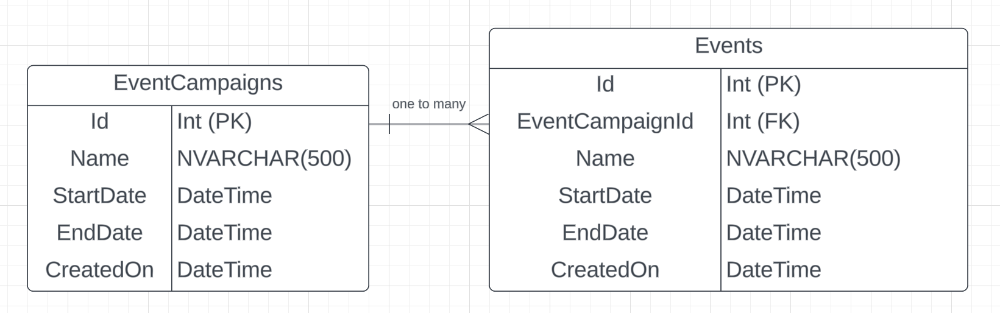

# multi-assignment (microservices)

## **Introduction**

Hello all, thank you for the opportunity for me to develop, architect and explain my decisions for this study case. 

All deliverables (and examples, starting with "example-"") will be inside the src/ folder.

src/application - contains all code and classes.
src/infrastructure - contains all scripts and K8S manifests.

You can find the repository [here](https://github.com/joao00paixao/multi-assignment).

## **Business Context**
Property Technology Solutions B.V. is pioneering digital transformations within the real estate industry. Our flagship mobile application, serving over 500k users, is emblematic of our dedication and prowess. This app, harnessing event campaigns, notifications, and personalized offers, thrives on .NET Core 6.

Our API, at present, supports 10+ distinct shopping center mobile applications. Despite each having its unique data set, they uniformly benefit from our robust API architecture.

## 1. **Microservices Architecture & Integration:**

Detail your approach to structuring microservices and their inter-communication.

My best approach would be for these microservice applications to be orchestrated in a container orchestration technology like Kubernetes. 

Some of the benefits of having them living in containers and kubernetes itself are the following:

- Containerization (applications can be deployed all in the same environment)
- Security (network and "operating system" are isolated in the pods level, and on the K8S cluster level we can have certain port-forwarding / load balancing rules through K8S Services)
- Scaling (we can define the number of pods running parallel based on metrics)
-  Health-checks (health checks are regularly done to verify status of the pod, if the pod dies one is recreated with the same configuration)

For their inter-communication it is very simple. Kubernetes provides us with a resource called Service. A key aim of Services in Kubernetes is to abstract the exposure of groups of pods over the network. 

**Example**: We have three pods running an image uploading service. The frontend doesn't need to connect to a specific one, it just needs to find one of the three, and it will most likely be the most available one in terms of worker node resource usage. With this service we can abstract this to one single endpoint on the frontend side. 

We can apply the example to this context, but the frontend here would be microservice B and the image uploading service microservice A. They would be able to intercommunicate with eachother and be scalable.

For example ms-a.mycompany.com (with an ingress rule for this specific endpoint type, or the service's clusterIP which is constant and doesn't change) could live as the connection address in the ms-b application configuration and ms-b would be able to communicate with ms-a, all internally.

---

Explain strategies for seamless integration of microservices and handling potential issues.

For multiple replicas of one microservice the answer is in the previous question's answer and can be resolved using a K8S Service. The generated address will forward the request to one of the available microservice pods (load balancing).

For different microservices intercommunication there are several factors we must handle or take account of:

- Network Isolation
- Availability
  - Load balancing
  - Automatic Scaling
- Resilience
  - Self-healing
- Observability
  - Logging
  - Metrics
  - Tracing
  - Alerting

If the microservices need to communicate with eachother and live in the same network they should be internal. If they need to communicate with external clients then we can either whitelist an IP address/range OR create a public endpoint.

If there is a lot of demand on one pod we should increase the amount of replicas in order to split the demand and not overwork one pod. This can also be said of the cluster's node itself, we can have pods in different worker nodes so we can split the work also between different servers. We can also load balance users between all active pods.

If a microservice crashes it must revive itself and be active, we need to atleast have one pod running.

For any other potential issues like application exceptions, pod logs and cluster errors we should have good structured logging according to the type of log. We should treat errors and exceptions with higher priority and we need observability or alerting of this. 

Metrics are also very important in order to measure resource consumption, vitals or executed actions during the application's timeframe. 

Tracing is useful but necessary in order to measure an application's performance on certain actions.

## 2. **Data Model and API Design:**

### What is an event campaign?

An event campaign is a set or individual event organized through a period of time. It could be a discount/sale phase like black friday, or maybe a new website launch phase, etc.

The three main attributes would be the one-to-many relationship between an event campaign and it's events, the start and end dates of events as they might not be permanent events and a name/id so we can distinct events.

### Database Schema

Apart from the columns there are also a few considerations, we need to create indexes for the most often accessed columns, like the Id, Name, StartDate and EndDate column so we can optimize reads. We can use a clustered or non-clustered index, in this case we'll use a clustered as it's faster.

The Id columns will be Primary Keys with an automatic identity incrementation of 1 starting at 0, so each row inserted the Id will be incremented.

I have created a Schema so we can separate these tables logically. The Schema could have been called Events but I decided to name it Marketing.

You can find the sample code in src/2-data-model-and-api-design/model folder.

### API Endpoints

Following REST design we'll create endpoints for fetching/creating event campaigns and events.

We'll have the following endpoint groups:

- /campaign-events/
- /events/

From these two groups we can then have logical separation of concerns.

Apart from that we also need to decide on the endpoint methods, following rest design I used the following:

GET - to fetch simple information with a safe parameter  
POST - to create from a JSON object on the request's body  
PUT - we could have used PUT too but we would need to specify the id in the request, this should be used if we plan to update the resource on the server (not implemented)  
PATCH - to do a partial update (not implemented)  
DELETE - to delete a resource

#### Campaign Events API Documentation

##### Campaign Events GET Endpoints

The {id} is a parameter as part of the endpoint address path, it could also be part from a querystring like /campaign-events?id={id} but it's not the best practice.

We could also have a GET endpoint to get all campaign events but I did not implement it.

- GET /campaign-events/{id} (gets campaign event by id)
- GET /campaign-events/{id}/events (gets a campaign event's sub events)
- GET /campaign-events/live (gets all live events)

##### Campaign Events POST Endpoints

The POST request must have a body of a JSON object with the following format:

    {  
     "name": "xxxxx",  
     "startDate": "yyyy/MM/dd hh:mm:ss",  
     "endDate": "yyyy/MM/dd hh:mm:ss"  
    }

- POST /campaign-events/

##### Campaign Events DELETE Endpoints

The DELETE request will use a path parameter of {id} to delete that resource

- DELETE /campaign-events/{id}

#### Events

##### Events GET Endpoints

- GET /events/{id} (gets campaign event by id)
- GET /events/live (gets all live events)

##### Events POST Endpoints

The POST request must have a body of a JSON object with the following format:

    {  
     "name": "xxxxx",  
     "campaignEventId": "xxxx"
     "startDate": "yyyy/MM/dd hh:mm:ss",  
     "endDate": "yyyy/MM/dd hh:mm:ss"  
    }

- POST /vents/

##### Events DELETE Endpoints

The DELETE request will use a path parameter of {id} to delete that resource

- DELETE /events/{id}

